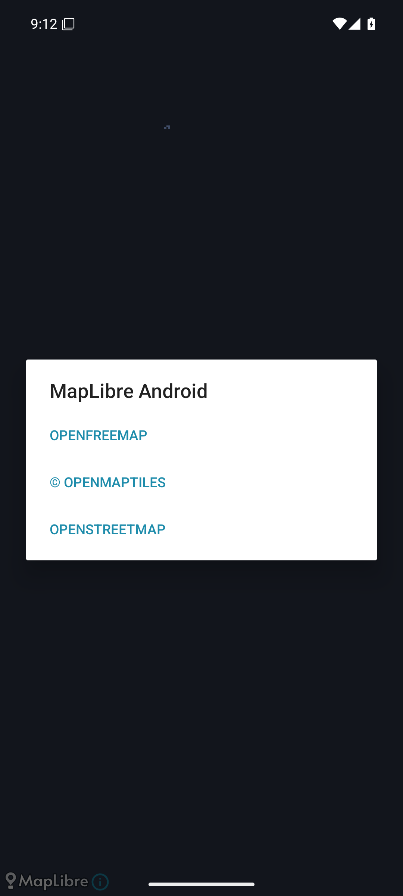

# P1-002 MapLibre PoC evidence

Date: 2026-07-28

Candidate: MapLibre Native Android OpenGL 13.4.1 with OpenFreeMap Liberty

Result: SDK technical PoC passes on the fixed official AVD; the public OpenFreeMap
service is not approved as the production provider.

## Reproducible configuration

- Commit under evaluation: `20d0704` plus the P1-002 working diff.
- Application ID: `io.github.jay890829.trailveil`.
- Variant: `mapLibreInternal`; it is isolated from `debug` and `internal`, uses the
  fixed TrailVeil internal signer, and has no application ID suffix.
- SDK: `org.maplibre.gl:android-sdk-opengl:13.4.1`.
- Online style: `https://tiles.openfreemap.org/styles/liberty`.
- Offline mode: packaged local JSON style plus the same locally rendered fog.
- Dataset: P1-001 deterministic 100,000-point fixture, 500 segments, zoom 8,
  nine 256x256 fog tiles combined into one 768x768 `ImageSource`.
- Host: Windows, Microsoft OpenJDK 17.0.19, Android Emulator 36.6.11, AEHD 2.2.
- AVD: `TrailVeil_API_36`, Android 16/API 36 Google APIs x86_64,
  fingerprint `google/sdk_gphone64_x86_64/emu64xa:16/BE2A.250530.026.F3/13894323:userdebug/dev-keys`.
- AVD display: 1080x2400, density 420, 60 Hz; four virtual cores and
  2,531,836 kB guest RAM.
- Graphics: Android Emulator OpenGL ES Translator, AMD Radeon RX 9070 XT,
  OpenGL ES 3.1.

This AVD is reproducible but is not a physical mid-range phone. Its results prove
the integration and expose emulator-specific failures, but they do not replace
the later physical-device P4/P5 performance and field gates.

## Implementation and correctness

The PoC keeps map-SDK code in `src/mapLibreInternal`. The renderer, deterministic
dataset, Web Mercator math, spatial selection, and mosaic assembly remain
SDK-independent JVM code.

- A single traversal conservatively assigns segments to affected tiles,
  including reveal radii, boundary-crossing capsules, world wrapping, the
  documented exact-180-degree rule, and dateline neighbors.
- Nine independently rendered masks are copied row-for-row into one mosaic.
  A single `ImageSource`/`RasterLayer` avoids the gaps and double-alpha overlap
  observed with nine separate image layers.
- Initial one-point rendering and the 100,000-point update both use the same
  renderer and source. The update is visible through `ImageSource.setImage`.
- The raster layer uses zero fade and nearest resampling.
- The MapView receives `onCreate`, `onStart`, `onResume`, `onPause`, `onStop`,
  `onSaveInstanceState`, `onLowMemory`, and `onDestroy`.
- Timing logs contain only stage, duration, point count, and tile count. A runtime
  log audit found no latitude/longitude fields.

Focused and baseline JVM results:

```text
7 suites, 31 tests, 0 failures, 0 errors, 0 skipped
FogPocSpatialSelectionTest: 3
FogPocSupportTest: 5
FogTileMosaicTest: 3
P1-001 fog core: 19
PlaceholderRouteTest: 1
```

The final screenshot has continuous fog with no internal tile seam:


## Performance

Each of the following 20 samples is a cold activity launch of the final APK.
`update` covers selection, nine tile renders, and mosaic assembly for all
100,000 points. `next frame` is measured from the same update start until the
first MapLibre rendered-frame callback after `setImage`.

```text
launch_ms =
673,696,607,706,658,650,663,634,667,650,
654,652,669,672,666,672,669,699,665,671

update_ms =
643,617,663,623,648,587,581,590,580,600,
632,642,637,620,675,644,655,638,662,633

next_rendered_frame_ms =
647,622,667,627,652,592,585,594,591,604,
636,647,641,625,679,649,659,642,667,637
```

Nearest-rank results:

| Metric | p95 | Maximum | Gate | Result |
|---|---:|---:|---:|---|
| Cold activity launch | 699 ms | 706 ms | informational | PASS |
| 100k update | 663 ms | 675 ms | <= 2,000 ms | PASS |
| 100k update to next rendered frame | 667 ms | 679 ms | <= 2,000 ms | PASS |

A bounded `dumpsys meminfo` sampler started with a cold activity launch and ran
through fixture creation, the 100,000-point update, and the post-frame steady
state. It captured 22 valid samples from 541 ms through 3,987 ms:

```text
pss_kb =
40238,64708,82529,92491,95452,100833,111977,128832,112038,109789,110637,
129741,111869,111853,111853,111853,111853,111853,111853,111853,111854,111853
peak observed PSS: 129,741 kB at 2,427 ms
post-update PSS: 111,853 kB
```

The peak observed PSS is below the 250 MB gate on the official AVD. This is a
bounded sampling result, not proof of the later physical-device peak gate.

SurfaceFlinger latency was cleared for the MapLibre `SurfaceView`, followed by
30 alternating 180 ms pan gestures:

```text
refresh period: 16,666,666 ns
valid presentation intervals: 126
p95 interval: 17.241 ms
maximum interval: 20.245 ms
intervals over 32 ms: 0 (0%)
intervals over 700 ms: 0 (0%)
```

This passes the <= 32 ms p95 and < 1% frozen-frame gates on the official AVD.
A second fixed mixed-operation script added six double-tap zooms and twenty pan
gestures. Its 126 presentation intervals had p95 17.268 ms, maximum 17.385 ms,
zero intervals over 32 ms, zero frozen intervals, a stable PID, 120,216 kB
post-action PSS, and no crash/ANR. Activity `gfxinfo` is not used for the map
result because MapLibre renders in a native `SurfaceView`; SurfaceFlinger
presentation timestamps cover that surface.

The initial implementation scanned all 100,000 points once per tile and took
10,978 ms on this same AVD. The spatial selector reduced the final p95 to
663 ms. A one-pixel overlapping gutter was also rejected after visual testing
showed double-alpha seams; the final single-mosaic design removed the defect.

## Lifecycle and offline behavior

Twenty home/background and `--activity-reorder-to-front` cycles produced:

```text
PID before/after: 8827 / 8827
before SHA-256: 4C6EB326BBEC2D3FB707D1937500C6A370342C4F664D19F371DFEEC3E3298D2B
after  SHA-256: 4C6EB326BBEC2D3FB707D1937500C6A370342C4F664D19F371DFEEC3E3298D2B
crash/ANR: 0
duplicate timing sequence: 0
```

The exact screenshot match covers camera and fog preservation for background and
foreground transitions.

An independent review then found that the activity also needed to distinguish a
fresh launch from configuration-change restoration. The fixture camera is now
assigned only when `savedInstanceState == null`; MapView owns restored camera
state after recreation. After an intentional pan, ten portrait/landscape pairs
forced twenty activity recreations. PID `11205` remained stable, all twenty fog
update sequences completed, and no crash/ANR occurred. The map-content crop
`[0,128][1080,2330]` had zero changed pixels before versus after; all 504 changed
pixels in the full screenshot were confined to system status/navigation chrome.
This verifies restored camera and fog across recreation without logging a
coordinate.

For a true no-network launch, app data and logcat were cleared, Android airplane
mode was enabled, Wi-Fi was disabled, and a ping returned `Network is
unreachable`. The explicit local-style launch then completed:

```text
cold launch: 642 ms
style load: 3 ms
initial one-point render: 220 ms
100k update: 613 ms
next rendered frame: 615 ms
OpenFreeMap/HTTP/UnknownHost messages: 0
crash/ANR: 0
```

Network and Wi-Fi were restored and Android reported validated cellular and
Wi-Fi transports. The map is not part of TrailVeil's future recording state
machine, and no location, Room, or recording code is present in this variant;
therefore map/network failure cannot block the local fog computation. This PoC
does not claim an offline basemap.

## APK, permissions, signing, and dependency audit

Final artifact:

```text
app/build/outputs/apk/mapLibreInternal/app-mapLibreInternal.apk
size: 54,927,223 bytes
SHA-256: C9012E935AFC00FC5AB8BA85D2C33E34B753C35AE4391752C49B22FA04803D78
APK Signature Scheme v2: verified
signers: 1
signer certificate SHA-256:
307963F32352E6565889982C2B6021AF960C94DB5C40E0E38C52A2F2CF13856D
```

The merged manifest contains only `INTERNET`, `ACCESS_NETWORK_STATE`, and
AndroidX's app-local `DYNAMIC_RECEIVER_NOT_EXPORTED_PERMISSION`. Location and
Wi-Fi-state permissions contributed by transitive manifests are explicitly
removed. No key, account, billing setup, signing material, coordinate, or
credential is stored in the repository.

Runtime dependencies relevant to the map variant:

```text
org.maplibre.gl:android-sdk-opengl:13.4.1
org.maplibre.gl:android-sdk-turf:6.0.1
org.maplibre.gl:android-sdk-geojson:6.0.1
org.maplibre.gl:maplibre-android-gestures:0.0.4
com.squareup.okhttp3:okhttp:4.12.0
com.jakewharton.timber:timber:5.0.1
```

No dependency name matched analytics, telemetry, Firebase, Sentry, or
Crashlytics. This is a dependency audit, not proof that arbitrary provider
traffic is impossible. A clean online runtime log exposed only
`tiles.openfreemap.org`, with zero app crash/ANR and zero coordinate-bearing
TrailVeil timing logs. Online style, sprite, glyph, and vector-tile requests
necessarily disclose requested URLs to OpenFreeMap/Cloudflare; tile `z/x/y`
identifiers reveal an approximate viewed map area. TrailVeil does not upload its
canonical tracks, precise point list, fog bitmap, or reveal geometry, but the
viewport/network boundary must still be disclosed in the app privacy policy.

MapLibre Native is BSD-2-Clause. The exact 13.4.1 copyright notice and license
are packaged as `R.raw.maplibre_third_party_notices` and referenced by manifest
metadata so binary redistribution retains the notice.

## Attribution, provider terms, privacy, and cache

The MapLibre attribution dialog exposes `OPENFREEMAP`, `OPENMAPTILES`, and
`OPENSTREETMAP`:



Official sources reviewed on 2026-07-28:

- [MapLibre Native Android 13.4.1 release](https://github.com/maplibre/maplibre-native/releases/tag/android-v13.4.1)
- [MapLibre ImageSource Android API](https://maplibre.org/maplibre-native/android/api/-map-libre%20-native%20-android/org.maplibre.android.style.sources/-image-source/-image-source.html)
- [MapLibre Android rendering backends](https://maplibre.org/maplibre-native/docs/book/platforms/android/android-rendering-backends.html)
- [MapLibre Native BSD-2-Clause license](https://github.com/maplibre/maplibre-native/blob/android-v13.4.1/LICENSE.md)
- [OpenFreeMap quick start and attribution](https://openfreemap.org/quick_start/)
- [OpenFreeMap terms](https://openfreemap.org/tos/)
- [OpenFreeMap privacy policy](https://openfreemap.org/privacy/)

Provider findings:

- OpenFreeMap documents the Liberty style for MapLibre Native and requires the
  OpenFreeMap/OpenMapTiles/OpenStreetMap attribution shown above.
- The public service requires no app key, account, or billing.
- Regular logs omit IP addresses but retain anonymized browser/referrer/time/OS
  data indefinitely. IP logging may be enabled for up to 30 days during a
  security incident, and Cloudflare may process requests.
- The service is supplied as-is, has no SLA or support commitment, and may be
  discontinued without notice.
- The terms prohibit automated collection without permission. Because public
  endpoint prefetch/bulk offline caching is not expressly authorized, TrailVeil
  must not build offline regions from that endpoint. OpenFreeMap's documented
  downloadable planet images are a self-hosting path, not permission to bulk
  download the public tile service.

## Verdict and complete quality gate

MapLibre Native itself passes this technical PoC on the official AVD: dynamic
transparent fog, latency, PSS, SurfaceFlinger frame pacing, lifecycle, offline
failure isolation, attribution, variant isolation, fixed signing, and license
notice are demonstrated.

The public OpenFreeMap service fails TrailVeil's production operational gate
because it offers no SLA/support/continuity guarantee and its terms do not
clearly authorize app-managed offline prefetch. It remains suitable only for
this internal online PoC. A production MapLibre choice requires a contracted
provider or self-hosting, plus a separate physical-device validation.

Final host gate:

```text
gradlew --no-daemon clean assembleDebug lintDebug testDebugUnitTest \
  assembleInternal lintInternal assembleMapLibreInternal lintMapLibreInternal

BUILD SUCCESSFUL in 43s
141 actionable tasks: 138 executed, 3 up-to-date
```

The local official AVD also passed `connectedDebugAndroidTest`: one Compose
instrumentation test, zero failures, `BUILD SUCCESSFUL in 22s`.

A fresh-context HIGH-risk verifier independently returned PASS with no remaining
P0/P1/P2 findings after the lifecycle, mixed pan/zoom, peak-PSS, and privacy
gaps were corrected and rechecked.
